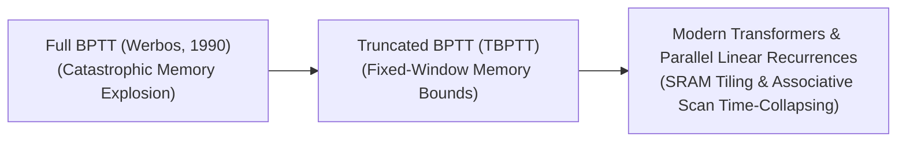

# Awesome-Backpropagation-Through-Time
## Backpropagation Through Time (BPTT): Evolution, Variants, & Applications

Backpropagation Through Time (BPTT) is a hardware-aware optimization and gradient calculation framework designed to train sequence-processing neural networks, primarily Recurrent Neural Networks (RNNs), Long Short-Term Memory (LSTM) networks, and Gated Recurrent Units (GRUs). Because recurrent networks reuse the same weights across sequential time-steps in a cyclic loop, standard backpropagation cannot be applied directly. BPTT solves this by mathematically "unrolling" the recurrent architecture into a massive, deep feed-forward neural network graph across the sequence's timeline. It then tracks errors from the terminal output step backward through each historical time-step to update the shared parameter matrices.

---

## 1. The Chronological Evolution

The technical implementation of temporal gradient tracking has transitioned from absolute global sequence unrolling to fixed memory slices, moving toward parallelized parallel structures and forward-mode sensitivity checks.

*   **The Full Sequence Unrolling Era (Werbos, 1990)**
    *   *Concept:* Formally popularized by Paul Werbos. It unrolled the recurrent network graph over the absolute entire length of the training sequence (e.g., thousands of continuous frames or words), keeping all intermediate hidden states cached in memory.
    *   *Limitation:* Suffered from a catastrophic **Memory Explosion ($O(T)$ space complexity)**. It was also highly susceptible to the **Vanishing and Exploding Gradient Problem**, where multiplying errors across hundreds of identical recurrent matrices caused gradients to collapse to absolute zero or explode to infinity.
*   **The Truncated Window Era (Truncated BPTT / TBPTT)**
    *   *Concept:* Introduced an adjustable memory compromise. Instead of unrolling the whole document, TBPTT chops the input sequence into short, manageable blocks or windows (e.g., $k_1$ forward steps and $k_2$ backward steps). Gradients are calculated and parameters are updated strictly within that localized window before moving to the next chunk.
    *   *Significance:* The industry-standard baseline for training LSTMs and GRUs for decades, successfully keeping activation memory consumption bounded on standard silicon cards.
*   **The Parallel Recurrence & Associative Scan Era (Modern Shift, ~2023–Present)**
    *   *Concept:* Triggered by the rise of modern hardware-aware state spaces (like Mamba) and Linear Transformers. Instead of executing sequential, step-by-step unrolling (which stalls GPU Tensor Cores), modern architectures reframe BPTT through the lens of parallel algorithms. They use **Parallel Associative Scans** to compress the entire time-step calculation into a single parallelized matrix multiplication step in fast GPU SRAM.

---

## 2. Core Functional & Architectural Variants

BPTT implementations are strictly categorized based on the temporal depth of the unrolling graph and how the historical parameters are handled during the backward pass.

*   **Full Backpropagation Through Time (Full BPTT)**
    *   *Mechanism:* Processes the entire sequential timeline from step $t=1$ to $t=T$ in the forward pass, and backpropagates errors sequentially from step $T$ all the way back to step $1$ to execute a single, massive global parameter update.
*   **Truncated BPTT ($k_1, k_2$)**
    *   *Mechanism:* Splits execution based on two distinct hyperparameters:
        1.  $k_1$: The number of forward pass simulation steps executed before calculating a gradient block.
        2.  $k_2$: The absolute number of historical time-steps the gradient is permitted to travel backward before the unrolled graph is clipped.
*   **Real-Time Recurrent Learning (RTRL / Forward-Mode Alternative)**
    *   *Mechanism:* Flips the tracking direction entirely. Instead of running a backward pass after a sequence block finishes, RTRL calculates the partial derivatives of all states with respect to weights *forward in time* at every individual step.
    *   *Pros:* Requires absolute zero memory storage for historical activations ($O(1)$ temporal memory), making it ideal for edge chips, though it scales terribly in parameter space ($O(N^4)$ complexity).

---

## 3. Structural Gradient Stabilization Types

Because unrolling deep recurrent loops acts mathematically like stacking hundreds of dense neural layers sequentially, BPTT requires explicit stabilization parameters to prevent gradient collapse.

*   **Hard Gradient Norm Clipping**
    *   *Mechanism:* Intercepts the unrolled gradient vector ($g$) right before the optimizer execution layer. If the total mathematical norm of the gradient crosses a target threshold, the vector is squashed: $g \leftarrow g \cdot \frac{\text{threshold}}{\|g\|}$.
    *   *Significance:* The mandatory safety rail used during BPTT training to stop explosive gradients from corrupting weight parameters.
*   **Gated Memory Cell Integration (LSTM / GRU Blocks)**
    *   *Mechanism:* Swaps standard linear neurons with specialized cell gates. The **Forget Gate** and **Input Gate** form an internal linear highway (the Cell State), allowing historical gradients to flow backward through time over hundreds of steps without experiencing exponential decay.
*   **Surrogate Gradient Approximation (Spiking Networks / SNN-BPTT)**
    *   *Mechanism:* Used when running BPTT over Spiking Neural Networks. Because binary spike thresholds are non-differentiable step functions, the backward pass substitutes the step with a smooth curve (like an arctangent or sigmoid) to pass temporal gradients safely.

---

## 4. Production Engineering Challenges & Hardware Solutions

While BPTT provides elegant mathematical tracking over sequence histories, its sequential execution behavior conflicts with the parallel architecture of modern GPUs.

*   **The Sequential GPU Underutilization Bottleneck**
    *   *The Problem:* Standard BPTT requires step $t$ to completely finish its calculation before step $t+1$ can initiate its forward pass. This creates a severe **Memory-Bandwidth Bottleneck** where the GPU's massive parallel computing arrays sit idle, waiting for a single sequential matrix vector to update, dragging down training throughput.
    *   *Mitigation:* transition away from standard recurrent structures toward **Parallel Selective Scan Kernels** (like those used in Mamba), which fuse the temporal updates directly into GPU SRAM registers to process sequences concurrently.
*   **The Hidden State Memory Wall**
    *   *The Problem:* In massive, deep recurrent networks operating over long sequences, storing every single multi-dimensional hidden state vector across thousands of time-steps for the backward loop completely saturates VRAM, triggering Out-Of-Memory errors.
    *   *Mitigation:* Implementing **Activation Checkpointing**, which discards non-boundary hidden states during the forward pass and selectively recomputes them on-the-fly exactly when the backward temporal loop demands them.

---

## 5. Frontier Real-World AI Applications

*   **State-Space Language Model Pre-Training Loops (Mamba / StripedHyena)**
    *   *Application:* Serves as the underlying training pipeline for linear-scaling alternative foundation architectures. Hardware-optimized variations of temporal backpropagation allow these networks to learn long-range context dependencies over millions of tokens with flat $O(1)$ inference memory overhead.
*   **High-Frequency Continuous Time-Series & Telemetry Prediction**
    *   *Application:* Monitors high-volume, real-time industrial streaming arrays (such as seismic activity logs, multi-axis aerospace telemetry, or cardiac ICU patient tracking). BPTT-optimized LSTMs ingest unevenly spaced continuous data vectors, predicting failure states precisely.
*   **Neuromorphic Event-Based Computer Vision Tracking**
    *   *Application:* Processes continuous, asynchronous data streams from Event-Based Cameras (Dynamic Vision Sensors). Deep Spiking Neural Networks are trained via surrogate-gradient BPTT to track high-speed moving targets (such as autonomous drone collision-avoidance arrays) with microsecond temporal precision.
