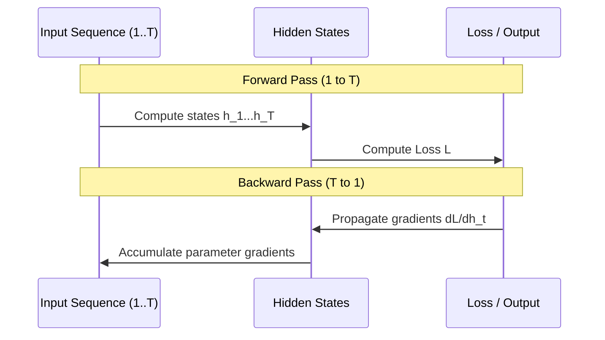

# Full Backpropagation Through Time (Full BPTT)

**Full BPTT** processes the entire sequence timeline from $t=1$ to $t=T$ and backpropagates errors across all steps.

## Mechanism
1. **Forward Pass:** Compute $h_t$ for $t = 1, \dots, T$. Keep all $h_t$ in memory.
2. **Backward Pass:** Calculate gradient starting from loss $\mathcal{L}_T$ all the way back to $t=1$.
3. **Update:** Apply gradient update to parameters once per sequence.

[Back to README](../README.md)
