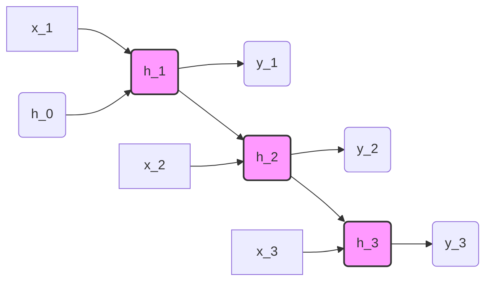

# The Full Sequence Unrolling Era (Werbos, 1990)

The **Full Sequence Unrolling Era** represents the foundational period of training recurrent neural networks (RNNs) using Backpropagation Through Time (BPTT). Popularized by Paul Werbos in 1990, this technique unrolls the recurrent structure across the entire length $T$ of the sequence.

## Mathematical Formulation
For a sequence of length $T$, the recurrent state equation is:
$$h_t = f(W_{hh} h_{t-1} + W_{xh} x_t + b_h)$$
The error gradient with respect to the recurrent weights $W_{hh}$ is computed by summing the gradients across all time steps:
$$\frac{\partial \mathcal{L}}{\partial W_{hh}} = \sum_{t=1}^T \frac{\partial \mathcal{L}_t}{\partial W_{hh}}$$
Where each term is calculated via the chain rule backwards through time:
$$\frac{\partial \mathcal{L}_t}{\partial h_k} = \frac{\partial \mathcal{L}_t}{\partial h_t} \prod_{j=k+1}^t \frac{\partial h_j}{\partial h_{j-1}}$$

## Computational Graph
Below is the visualization of the unrolled computational graph:

## Challenges
1. **Memory Explosion:** $O(T)$ storage complexity, as every hidden state $h_t$ must be saved for the backward pass.
2. **Vanishing/Exploding Gradients:** The term $\prod_{j=k+1}^t \frac{\partial h_j}{\partial h_{j-1}}$ involves repeated matrix multiplications of $W_{hh}^T$, leading to exponential decay or growth.

[Back to README](../README.md)
