# The Sequential GPU Underutilization Bottleneck

Traditional RNNs suffer from a **sequential execution bottleneck** because state $t$ cannot be computed until state $t-1$ completes, leading to low GPU Tensor Core utilization.

## Mitigations
Transition to modern linear recurrences and Parallel Selective Scans that compute the recurrent states concurrently or map them to hardware-fused CUDA kernels.

```mermaid
gantt
    title Sequential vs Parallel Recurrent Execution
    dateFormat  X
    axisFormat %s
    section Sequential (Traditional)
    Step 1 :active, 0, 1
    Step 2 : 1, 2
    Step 3 : 2, 3
    section Parallel (Associative Scan)
    Step 1-3 Parallelized :active, 0, 1
```

[Back to README](../README.md)
