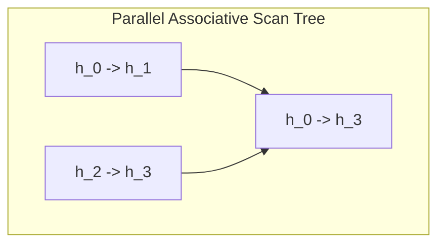

# The Parallel Recurrence & Associative Scan Era

The **Parallel Recurrence & Associative Scan Era** (circa 2023–Present) resolves the sequential processing bottleneck of traditional recurrent networks using parallel prefix scans on GPUs.

## Concept
In a linear recurrent system, the state transitions can be written as:
$$h_t = A_t h_{t-1} + B_t x_t$$
This recurrence is associative when formulated as a scan operator $\bullet$:
$$(A_i, B_i) \bullet (A_j, B_j) = (A_i A_j, A_i B_j + B_i)$$
Using a Parallel Associative Scan (such as Blelloch's scan), the computation can be parallelized over the sequence length in $O(\log T)$ time instead of sequential $O(T)$ steps.

[Back to README](../README.md)
