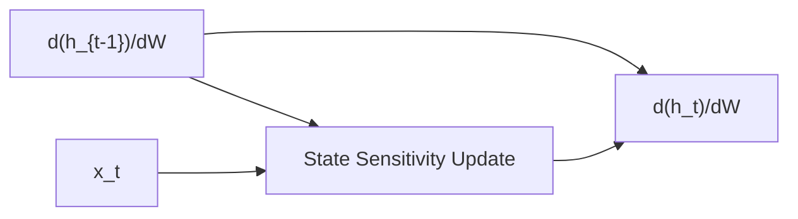

# Real-Time Recurrent Learning (RTRL)

**Real-Time Recurrent Learning (RTRL)** is a forward-mode alternative to BPTT. Instead of propagating errors backwards, it propagates the sensitivity of the states forward in time.

## Formulas
For state $h_t$ and weights $W$:
$$\frac{\partial h_t}{\partial W} = \frac{\partial f}{\partial h_{t-1}} \frac{\partial h_{t-1}}{\partial W} + \frac{\partial f}{\partial W}$$
This allows updating weights online at every step without keeping a history of activations.

## Trade-offs
- **Memory:** $O(N^3)$ or $O(N^2)$ space for storing sensitivities, which is independent of sequence length $T$ ($O(1)$ temporal memory).
- **Time:** $O(N^4)$ computational complexity per step, making it extremely slow for large networks.

[Back to README](../README.md)
