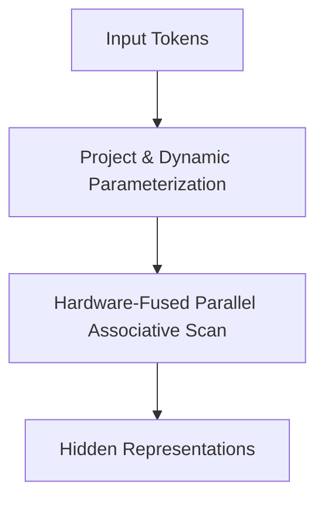

# State-Space Language Model Pre-Training Loops

**State-Space Models (SSMs)** like Mamba and StripedHyena replace standard attention mechanisms in language modeling, using optimized recurrent forms to handle long contexts efficiently.

## Selective SSM (Mamba)
By parameterizing the state transitions dynamically based on the input tokens, Mamba achieves selective focus over sequence histories while leveraging parallel hardware-aware scan kernels.

[Back to README](../README.md)
