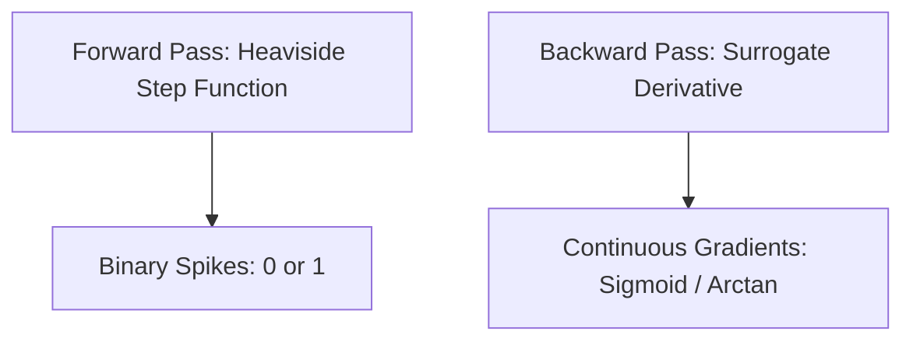

# Surrogate Gradient Approximation (Spiking Networks / SNN-BPTT)

**Surrogate Gradient Approximation** enables training of Spiking Neural Networks (SNNs) using gradient descent by replacing non-differentiable step functions with smooth curves during the backward pass.

## Concept
Spiking neurons output binary spikes $S(t) = \Theta(U(t) - \vartheta)$ where $\Theta$ is the Heaviside step function. The derivative of $\Theta$ is the Dirac delta function, which is zero everywhere except at the threshold, where it is infinite. To solve this, a surrogate function $\tilde{\Theta}'$ is used during backpropagation.

[Back to README](../README.md)
