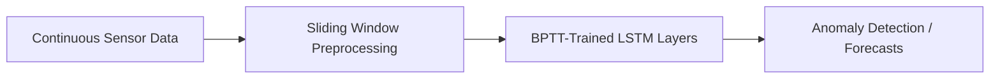

# High-Frequency Continuous Time-Series & Telemetry Prediction

LSTMs trained with BPTT are widely used to ingest and predict high-frequency continuous telemetry streams (e.g. cardiac ICU tracking, aerospace telemetry).

## System Overview
The model takes continuous sensor signals, runs them through recurrent networks to learn temporal dependencies, and outputs future predictions or anomaly detections.

[Back to README](../README.md)
