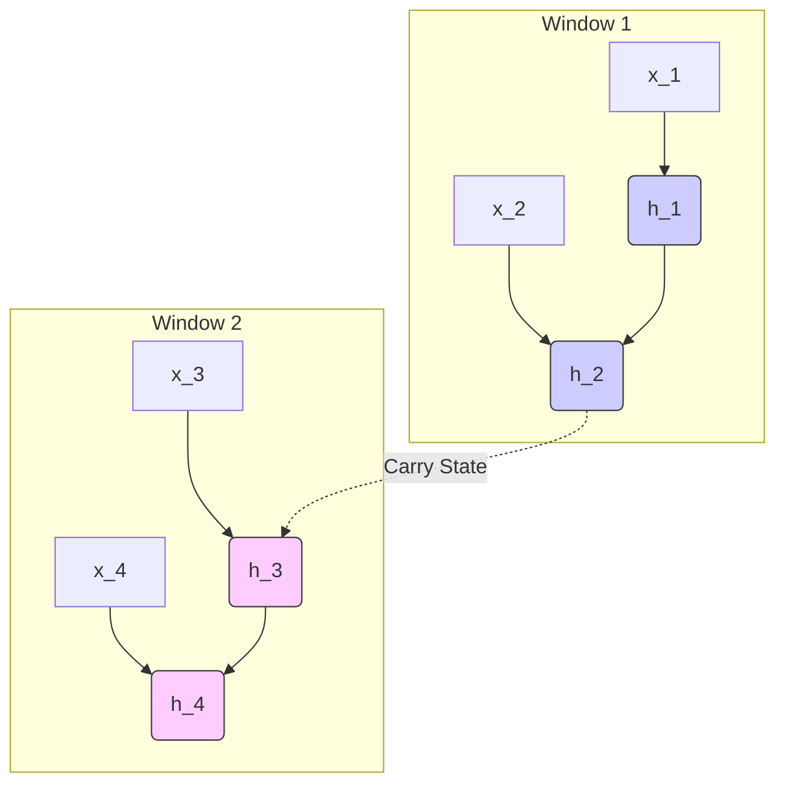

# The Truncated Window Era (Truncated BPTT / TBPTT)

The **Truncated Window Era** represents the practical shift towards handling long sequences by restricting the backward pass to a fixed size window.

## Concept
Instead of unrolling over the full length $T$, we partition the sequence into chunks of length $k_1$ (forward steps) and execute backpropagation for $k_2$ steps backwards (typically $k_2 = k_1$).

## Benefits
- **Memory Bounded:** Limits the activation caching to $O(k_2)$ instead of $O(T)$.
- **Feasible Training:** Allows training on infinite streams by propagating the hidden state forward while discarding old computational graphs.

[Back to README](../README.md)
